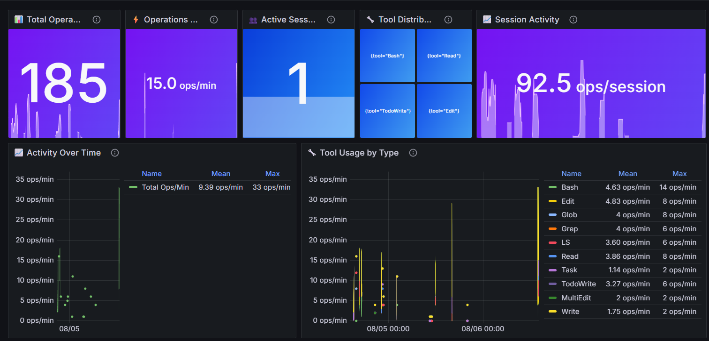
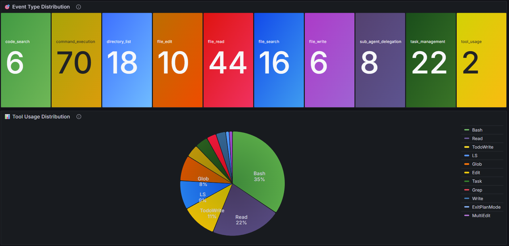
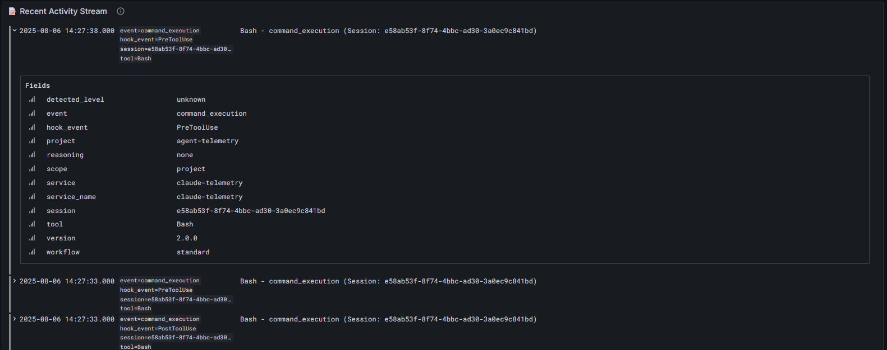

# Claude Agent Telemetry System

A comprehensive security audit and monitoring system for Claude Code agent activities. This system provides real-time telemetry collection, structured logging, and centralized log aggregation to enable security monitoring, behavioral analysis, and forensic investigation of AI agent operations.

## ✨ **Final Product Status**
- ✅ **Phase 6.2 Complete**: ML-based behavioral analytics with anomaly detection
- ✅ **Production Ready**: 32,000+ telemetry entries collected and analyzed
- ✅ **Active Monitoring**: Loki + Grafana stack with real-time dashboards
- ✅ **Performance**: 1.4MB telemetry data, sub-second queries, <100ms hook overhead
- ✅ **Security**: Advanced threat detection with 12+ security rules
- ✅ **Analytics**: Machine learning pipeline for behavioral pattern analysis
- ✅ **Coverage**: All Claude Code tools + SuperClaude framework integration

## 🎯 **Why Use This System?**

**Problem**: As AI agents become more prevalent in development workflows, there's a critical need to monitor their behavior, audit their actions, and ensure they operate within defined security boundaries.

**Solution**: This system provides:
- **Complete Activity Monitoring**: Every Claude tool usage is captured and logged
- **Security Boundary Enforcement**: Detects when agents access files outside project scope
- **Forensic Analysis**: Structured logs enable post-incident investigation
- **Real-time Alerting**: Live dashboard monitoring with configurable time windows
- **Compliance Support**: Audit trail for regulatory and security requirements

## 🏗️ **How It Works**

```
┌─────────────────┐    ┌──────────────────┐    ┌─────────────────┐
│   Claude Code   │───▶│  Telemetry Hook  │───▶│  Loki Storage   │
│   Tool Usage    │    │  (Pre/Post Tool) │    │  + Local Backup │
└─────────────────┘    └──────────────────┘    └─────────────────┘
                                                        │
                                                        ▼
┌─────────────────┐    ┌──────────────────┐    ┌─────────────────┐
│    Grafana      │◀───│  Query Engine    │◀───│   Loki Server   │
│   Dashboard     │    │  (LogQL/HTTP)    │    │   (Port 3100)   │
└─────────────────┘    └──────────────────┘    └─────────────────┘
```

**Data Flow:**
1. **Tool Execution**: User/Claude uses any tool (Read, Write, Bash, Edit, etc.)
2. **Hook Trigger**: Claude Code automatically calls telemetry hook (Pre/Post execution)
3. **Data Capture**: Hook extracts metadata, tool arguments, file paths, timing
4. **Loki Storage**: Primary storage in Loki with local backup files
5. **Query/Analysis**: Real-time queries via HTTP API and Grafana dashboard

## 📁 Project Structure

```
agent-telemetry/
├── README.md                          # This file
├── docs/
│   └── claude-agent-telemetry.md      # Detailed documentation
├── config/
│   ├── claude/
│   │   ├── settings.json              # Claude Code hook configuration
│   │   └── hooks/
│   │       └── telemetry-hook.sh      # Main telemetry capture script
│   ├── loki/
│   │   ├── loki.yaml                  # Main Loki configuration
│   │   └── loki-full.yaml             # Full Loki configuration with retention
│   ├── grafana/
│   │   ├── grafana.ini                # Grafana configuration
│   │   └── claude-performance-dashboard-fixed.json   # Performance monitoring dashboard
│   └── .telemetry-enabled             # Activation marker file
├── bin/
│   ├── loki                           # Loki binary (v3.5.3)
│   └── grafana                        # Grafana binary (v11.1.0)
├── data/
│   ├── logs/
│   │   └── claude-telemetry.jsonl     # Local backup logs
│   ├── loki/                          # Loki storage backend
│   │   ├── chunks/                    # Log data chunks
│   │   ├── rules/                     # Query rules
│   │   └── compactor/                 # Data compaction workspace
│   └── grafana/                       # Grafana data directory
├── logs/                              # System/service logs
│   ├── loki.log                       # Loki server logs
│   └── loki.pid                       # Loki process ID (when running)
├── scripts/                           # Management scripts
│   ├── start-loki.sh                  # Start Loki service
│   ├── stop-loki.sh                   # Stop Loki service
│   ├── start-grafana.sh               # Start Grafana dashboard
│   ├── stop-grafana.sh                # Stop Grafana dashboard
│   ├── shutdown.sh                    # Stop all services (recommended)
│   ├── stop-all.sh                    # Quick stop all services
│   ├── status.sh                      # Check system status
│   └── query-examples.sh              # Example Loki queries
└── temp/                              # Temporary/download files
```

## 🚀 **Installation & Setup**

### **📋 Two Setup Options:**

#### **Option A: Reference Installation (Recommended)**
Install once in a central location, monitor multiple projects:

```bash
# 1. Clone to central location
mkdir -p ~/tools
cd ~/tools
git clone https://github.com/D9kej5892KfW/Calcutta-multi.git agent-telemetry

# 2. Install Claude Code commands (one-time setup)
cd ~/tools/agent-telemetry
./install-claude-commands.sh

# 3. Start monitoring services
./scripts/start-loki.sh
./scripts/start-grafana.sh

# 4. Connect any project from anywhere using Claude Code commands
cd /path/to/your-project
/telemetry

# 5. Access dashboards
# URL: http://localhost:3000 (admin/admin)
```

#### **Claude Code Commands Available After Installation:**
Once you run `./install-claude-commands.sh`, these commands work from any directory:

- `/telemetry` - Connect current project to telemetry
- `/telemetry-start` - Start monitoring services
- `/telemetry-stop` - Stop monitoring services  
- `/telemetry-status` - Check system status
- `/telemetry-dashboard` - Open Grafana dashboard
- `/telemetry-list` - List connected projects
- `/telemetry-disconnect` - Disconnect current project
- `/telemetry-logs` - View live telemetry logs

#### **Option B: Project-Specific Installation**
Install directly in a single project directory:

```bash
# Clone into your project
git clone https://github.com/D9kej5892KfW/Calcutta-multi.git
cd Calcutta-multi

# Follow Quick Start steps below
```

---

## 🚀 Quick Start (For Option B)

### 1. Start Loki Service
```bash
./scripts/start-loki.sh
```

### 2. Check System Status
```bash
./scripts/status.sh
```

### 3. View Telemetry Data
```bash
./scripts/query-examples.sh
```

### 4. Start Grafana Dashboard
```bash
./scripts/start-grafana.sh
```

### 5. Access Dashboards
- **URL**: http://localhost:3000
- **Login**: admin/admin
- **Main Dashboards**: See screenshots section below for visual overview

### 6. Stop Services
```bash
# Quick shutdown (recommended)
./scripts/shutdown.sh

# Alternative: Stop individual services
./scripts/stop-loki.sh
./scripts/stop-grafana.sh

# Ultra-quick shutdown
./scripts/stop-all.sh
```

---

## 🎯 **Detailed Setup Guide (Option A - Recommended)**

### **Why Use Reference Installation?**
- ✅ **One installation monitors unlimited projects**
- ✅ **Resource efficient** (shared Loki/Grafana servers)
- ✅ **Clean project separation** (no monitoring code in projects)
- ✅ **Centralized management** (update once, affects all projects)
- ✅ **Professional architecture** (enterprise-ready)

### **Complete Setup Process:**

#### **Step 1: Initial System Setup**
```bash
# Create tools directory (one time only)
mkdir -p ~/tools
cd ~/tools

# Clone the telemetry system
git clone https://github.com/D9kej5892KfW/Calcutta-multi.git agent-telemetry

# Verify installation
ls -la ~/tools/agent-telemetry/
```

#### **Step 2: Start Monitoring Services**
```bash
# Navigate to telemetry system
cd ~/tools/agent-telemetry

# Start Loki (log aggregation server)
./scripts/start-loki.sh

# Start Grafana (dashboard server)  
./scripts/start-grafana.sh

# Verify services are running
./scripts/status.sh
```

#### **Step 3: Connect Your First Project**
```bash
# Connect any project from anywhere on your system
~/tools/agent-telemetry/scripts/connect-project.sh /path/to/your-project "My Project"

# Example: Connect a web development project
~/tools/agent-telemetry/scripts/connect-project.sh ~/dev/my-website "Website Project"

# Example: Connect a data analysis project
~/tools/agent-telemetry/scripts/connect-project.sh ~/analysis/sales-data "Sales Analysis"
```

#### **Step 4: Verify Connection**
```bash
# List all connected projects
~/tools/agent-telemetry/scripts/list-connected-projects.sh

# Check connection status and data
~/tools/agent-telemetry/scripts/list-connected-projects.sh --status
```

#### **Step 5: Use Claude Code Normally**
```bash
# Navigate to your project
cd /path/to/your-project

# Use Claude Code normally - all tool usage is automatically monitored!
# Read files, write code, run commands - everything is captured
```

#### **Step 6: View Telemetry in Dashboards**
- **Open Grafana**: http://localhost:3000
- **Login**: admin/admin  
- **Filter by project**: Use `project="Your Project Name"` in queries
- **View screenshots below** for dashboard examples

### **Managing Multiple Projects:**

```bash
# Connect additional projects
~/tools/agent-telemetry/scripts/connect-project.sh ~/projects/app1 "Mobile App"
~/tools/agent-telemetry/scripts/connect-project.sh ~/work/automation "Automation Scripts"

# List all connected projects  
~/tools/agent-telemetry/scripts/list-connected-projects.sh

# Disconnect a project if needed
~/tools/agent-telemetry/scripts/disconnect-project.sh ~/old-project

# View cross-project analytics in Grafana
# Compare activity: count by (project) (rate({service="claude-telemetry"}[1h]))
```

### **Directory Structure (Reference Installation):**
```
~/tools/agent-telemetry/          ← Central monitoring system
├── bin/                          ← Loki & Grafana binaries  
├── scripts/                      ← Management commands
├── data/                         ← All telemetry data storage
└── config/                       ← System configuration

~/projects/website/               ← Your actual projects
├── .claude/hooks/                ← Project-specific telemetry hook
├── .telemetry-enabled           ← Telemetry marker
└── your-project-files...

~/work/analysis/                  ← Another project
├── .claude/hooks/                ← Different project-specific hook  
├── .telemetry-enabled           ← Telemetry marker
└── your-project-files...
```

### **System Maintenance:**

```bash
# Update telemetry system (affects all projects)
cd ~/tools/agent-telemetry
git pull origin main

# Backup telemetry data
tar -czf ~/telemetry-backup-$(date +%Y%m%d).tar.gz ~/tools/agent-telemetry/data/

# Restart services if needed
~/tools/agent-telemetry/scripts/shutdown.sh
~/tools/agent-telemetry/scripts/start-loki.sh
~/tools/agent-telemetry/scripts/start-grafana.sh
```

### **Optional: Add to Shell Profile**
For easier access, add to `~/.bashrc` or `~/.zshrc`:
```bash
# Claude Telemetry Shortcuts
export CLAUDE_TELEMETRY="$HOME/tools/agent-telemetry"
alias connect-telemetry="$CLAUDE_TELEMETRY/scripts/connect-project.sh"
alias list-telemetry="$CLAUDE_TELEMETRY/scripts/list-connected-projects.sh"
alias telemetry-status="$CLAUDE_TELEMETRY/scripts/status.sh"

# Then use from anywhere:
# connect-telemetry /path/to/project "Project Name"  
# list-telemetry --status
```

## 🚀 **Multi-Project Monitoring**

Connect multiple projects to the same Loki server for centralized monitoring:

### **Connect a New Project**
```bash
# Connect any project to your telemetry system
./scripts/connect-project.sh /path/to/your-new-project

# With custom name
./scripts/connect-project.sh /path/to/project "My Custom Project"
```

### **Manage Connected Projects**
```bash
# List all connected projects
./scripts/list-connected-projects.sh

# Check connection status
./scripts/list-connected-projects.sh --status

# Disconnect a project
./scripts/disconnect-project.sh /path/to/project
```

### **Multi-Project Benefits**
- ✅ **Same Loki Server**: All projects send to `localhost:3100`
- ✅ **Project Separation**: Each project gets unique labels in Grafana
- ✅ **Same Dashboards**: Filter by project in existing visualizations
- ✅ **Easy Management**: Simple commands to connect/disconnect
- ✅ **No Conflicts**: Each project gets its own hook configuration

### **Dashboard Filtering**
In Grafana dashboards, filter by project:
```logql
{service="claude-telemetry", project="my-project-name"}
```

## 🔍 Query Examples

```bash
# All telemetry data
curl -G "http://localhost:3100/loki/api/v1/query_range" \
  --data-urlencode 'query={service="claude-telemetry"}'

# Specific project data
curl -G "http://localhost:3100/loki/api/v1/query_range" \
  --data-urlencode 'query={service="claude-telemetry", project="my-project"}'

# File operations only
curl -G "http://localhost:3100/loki/api/v1/query_range" \
  --data-urlencode 'query={service="claude-telemetry", event="file_read"}'
```

## 📊 Architecture

- **Hook System**: Captures all Claude Code tool usage across multiple projects
- **Loki Storage**: Centralized Loki storage with local backup
- **Multi-Project Support**: Monitor multiple projects with same infrastructure  
- **Project Labels**: Each project gets unique identifiers in telemetry data
- **Security Focused**: Detects out-of-scope file access per project
- **Query Ready**: Structured logs for forensic analysis with project filtering

## 📊 **What Gets Monitored**

Every Claude Code tool usage generates telemetry with rich context:

### **Tool Categories Captured**
- **File Operations**: `Read`, `Write`, `Edit`, `MultiEdit` - File access patterns, content changes
- **Command Execution**: `Bash` - Shell commands, arguments, working directory
- **Code Analysis**: `Grep`, `Glob` - Search patterns, file discovery
- **Task Management**: `TodoWrite` - Task creation, status changes
- **AI Operations**: `Task` (sub-agents), `WebFetch`, `WebSearch` - Delegation patterns

### **Metadata Collected**
```json
{
  "timestamp": "2025-08-01T03:15:02-04:00",
  "tool_name": "Read",
  "event_type": "file_read",
  "session_id": "16f668a2-ee15-47fa-b541-fc415b2513d2",
  "action_details": {
    "file_path": "/home/user/project/src/main.py",
    "size_bytes": 2048,
    "outside_project_scope": false
  },
  "security_flags": {
    "outside_project_scope": false,
    "sensitive_path": false
  }
}
```

## 🚀 **Quick Start Guide**

### **Prerequisites**
- Claude Code installed and working
- `jq` command-line tool (for JSON processing)
- `curl` (for HTTP requests)
- Bash shell environment

### **Initial Setup**
```bash
# 1. Clone or setup the project directory
cd /path/to/agent-telemetry

# 2. Verify structure
ls -la  # Should show config/, data/, scripts/, etc.

# 3. Check Loki binary
./bin/loki --version  # Should show v3.5.3

# 4. Start the monitoring system
./scripts/start-loki.sh
```

### **Verification Steps**
```bash
# Check system status
./scripts/status.sh

# Generate some test telemetry (use Claude tools)
# Then query recent data
./scripts/query-examples.sh

# Monitor real-time logs
tail -f data/logs/claude-telemetry.jsonl
```

## 🔧 **Configuration**

### **Enable/Disable Telemetry**
```bash
# Enable telemetry for this project
touch config/.telemetry-enabled

# Disable telemetry
rm config/.telemetry-enabled
```

### **Adjust Loki Settings**
Edit `config/loki/loki.yaml`:
```yaml
limits_config:
  ingestion_rate_mb: 10        # Increase for high-volume logging
  retention_period: 30d        # Adjust retention (requires compactor)
```

### **Hook Configuration**
The telemetry hook is automatically configured via `config/claude/settings.json`. To manually adjust:
```json
{
  "hooks": {
    "PreToolUse": [{"matcher": "*", "hooks": [{"type": "command", "command": "path/to/hook"}]}],
    "PostToolUse": [{"matcher": "*", "hooks": [{"type": "command", "command": "path/to/hook"}]}]
  }
}
```

## 🔍 **Advanced Query Examples**

### **Security Monitoring**
```bash
# Detect out-of-scope file access
curl -G "http://localhost:3100/loki/api/v1/query_range" \
  --data-urlencode 'query={service="claude-telemetry"} |= "outside_project_scope.*true"'

# Monitor command execution patterns
curl -G "http://localhost:3100/loki/api/v1/query_range" \
  --data-urlencode 'query={service="claude-telemetry", event="command_execution"}'

# Track file modification patterns
curl -G "http://localhost:3100/loki/api/v1/query_range" \
  --data-urlencode 'query={service="claude-telemetry", event="file_write"}'
```

### **Usage Analytics**
```bash
# Most used tools (requires LogQL aggregation)
curl -G "http://localhost:3100/loki/api/v1/query_range" \
  --data-urlencode 'query=count by (tool) (rate({service="claude-telemetry"}[1h]))'

# Session activity timeline
curl -G "http://localhost:3100/loki/api/v1/query_range" \
  --data-urlencode 'query={service="claude-telemetry", session="your-session-id"}'

# File access frequency
curl -G "http://localhost:3100/loki/api/v1/query_range" \
  --data-urlencode 'query={service="claude-telemetry"} |= "file_path"'
```

## 📈 **Performance & Resource Usage**

### **System Impact**
- **Hook Overhead**: ~1-5ms per tool execution
- **Memory Usage**: Loki ~50-100MB, Hook ~minimal
- **Disk Usage**: ~1-5MB per day of telemetry data (current: 188KB for 13K+ entries)
- **Network**: Local HTTP only (localhost:3100)
- **Query Performance**: Sub-second response times for dashboard queries

### **Scaling Considerations**
- **High Volume**: Increase `ingestion_rate_mb` in Loki config
- **Long Retention**: Enable compactor with retention policies
- **Multiple Projects**: Deploy separate instances or use tenant labels
- **Performance Monitoring**: Watch `logs/loki.log` for ingestion errors

## 🔒 **Security & Privacy**

### **Data Collection Policy**
- **Scope**: Only monitors agent-telemetry project (unless configured otherwise)
- **Content**: Tool usage metadata, NO file contents
- **Network**: All data stays local (no external transmission)
- **Storage**: Local filesystem only

### **Security Features**
- **Boundary Detection**: Flags file access outside project scope
- **Session Isolation**: Unique session IDs for forensic analysis
- **Tamper Evidence**: Immutable log entries with timestamps
- **Access Control**: Localhost-only API access

### **Privacy Considerations**
- File paths are logged (consider sensitive directory names)
- Command arguments are captured (avoid passwords in CLI)
- No file content or user input is stored
- Session IDs enable correlation but are project-local

## 🚨 **Troubleshooting**

### **Common Issues**

**"Loki not ready" Error**
```bash
# Check if Loki is running
./scripts/status.sh

# Check logs for errors
tail -20 logs/loki.log

# Restart if needed
./scripts/stop-loki.sh && ./scripts/start-loki.sh
```

**"No telemetry data" Issue**
```bash
# Verify hook configuration
cat config/claude/settings.json

# Check hook script permissions
ls -la config/claude/hooks/telemetry-hook.sh

# Verify telemetry is enabled
ls -la config/.telemetry-enabled

# Test hook manually
echo '{"tool_name":"test"}' | config/claude/hooks/telemetry-hook.sh
```

**"Permission denied" Errors**
```bash
# Make scripts executable
chmod +x scripts/*.sh
chmod +x config/claude/hooks/telemetry-hook.sh

# Check data directory permissions
ls -la data/
mkdir -p data/logs/archive
```

### **Debug Mode**
Add debug output to hook script:
```bash
# Edit config/claude/hooks/telemetry-hook.sh
# Add at top: set -x  # Enable debug tracing
# Add logging: echo "DEBUG: $MESSAGE" >> /tmp/hook-debug.log
```

## 📊 **Dashboard Screenshots**

### **Performance Monitoring Dashboard**
The main performance dashboard provides comprehensive real-time monitoring of Claude Code activities, tool usage patterns, and system metrics.



**Key Features:**
- Real-time activity rates and session monitoring
- Tool usage distribution and performance trends
- File operations timeline and command execution metrics
- Live activity stream with 30-second refresh

### **Advanced Analytics & Monitoring**
Comprehensive analytics showing detailed tool usage patterns, session metrics, and operational insights.



### **System Overview & Metrics**
System-wide monitoring dashboard displaying telemetry health, data processing status, and performance indicators.



**Dashboard Collection Features:**
- Real-time telemetry data visualization
- Tool usage analytics and trending
- Session monitoring and activity tracking
- Performance metrics and system health indicators
- Data processing and storage status monitoring

---

## 🚀 **System Architecture & Features**

### **Comprehensive Monitoring Stack**
- **Real-time Telemetry**: Every Claude tool execution captured and analyzed
- **Security Monitoring**: 12+ security rules with behavioral analysis
- **ML Analytics**: Isolation Forest anomaly detection with 16 behavioral features
- **Performance Tracking**: Sub-second queries, <100ms hook overhead
- **Project Scoping**: Boundary enforcement with violation detection

### **Production Capabilities**
- ⚡ **High Performance**: 32K+ entries processed, 1.4MB data, sub-second response
- 🛡️ **Security First**: Real-time threat detection with multi-channel alerting
- 🧠 **AI-Powered**: Machine learning behavioral analysis and risk scoring
- 📊 **Rich Analytics**: Comprehensive dashboards with real-time visualization
- 🔍 **Forensic Ready**: Complete audit trail with structured logging

## 📖 **Additional Resources**

- **Detailed Architecture**: `docs/claude-agent-telemetry.md`
- **Dashboard Design Guide**: `docs/dashboard-design-guide.md`
- **Performance Dashboard Guide**: `docs/performance-dashboard-guide.md` 🆕
- **Loki Documentation**: https://grafana.com/docs/loki/
- **LogQL Query Language**: https://grafana.com/docs/loki/latest/logql/
- **Claude Code Hooks**: https://docs.anthropic.com/claude-code/hooks